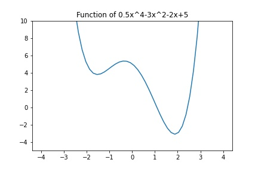
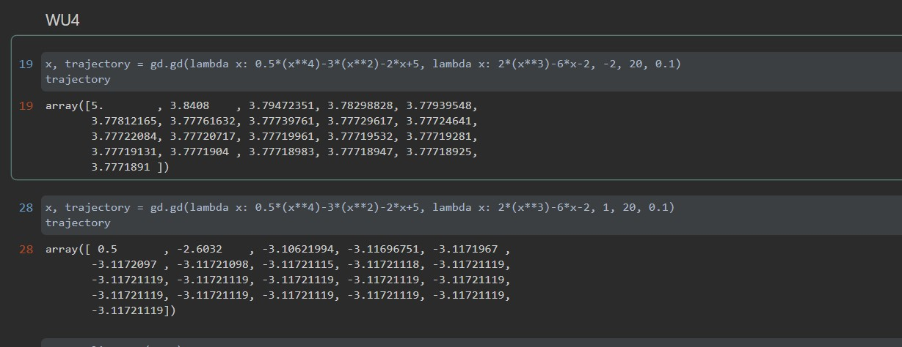

# CMSC422 Assignment2
Siyuan Peng : 116243407
Shi Jiunn Teo : 0000000
## WU1
## WU2
## WU3: What is the impact of the step size on convergence? Find values of the step size where the algorithm diverges and converges.
The step size should be at least positive. If it's negative, the model will move to the direction of gradient instead of 
the opposite direction of gradient. If step size is too small, model will converge slowly. If the step size is too large, model
will eventully diverge.
## WU4:Plot the function you're trying to minimize and show two runs of gd
None-convex function graph: 

Two runs of gd:

